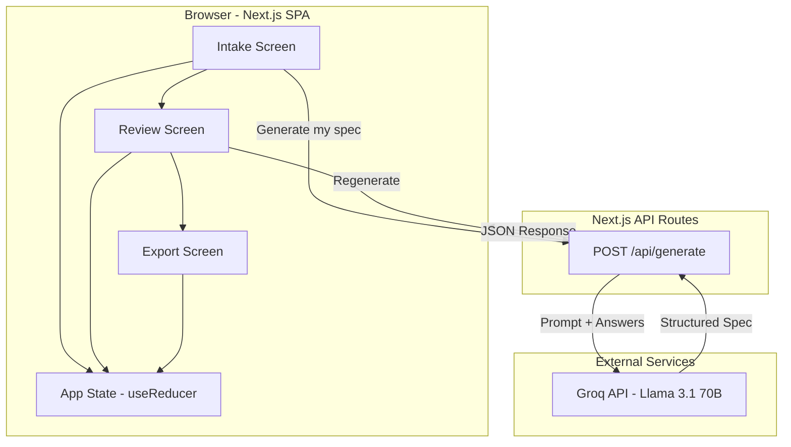
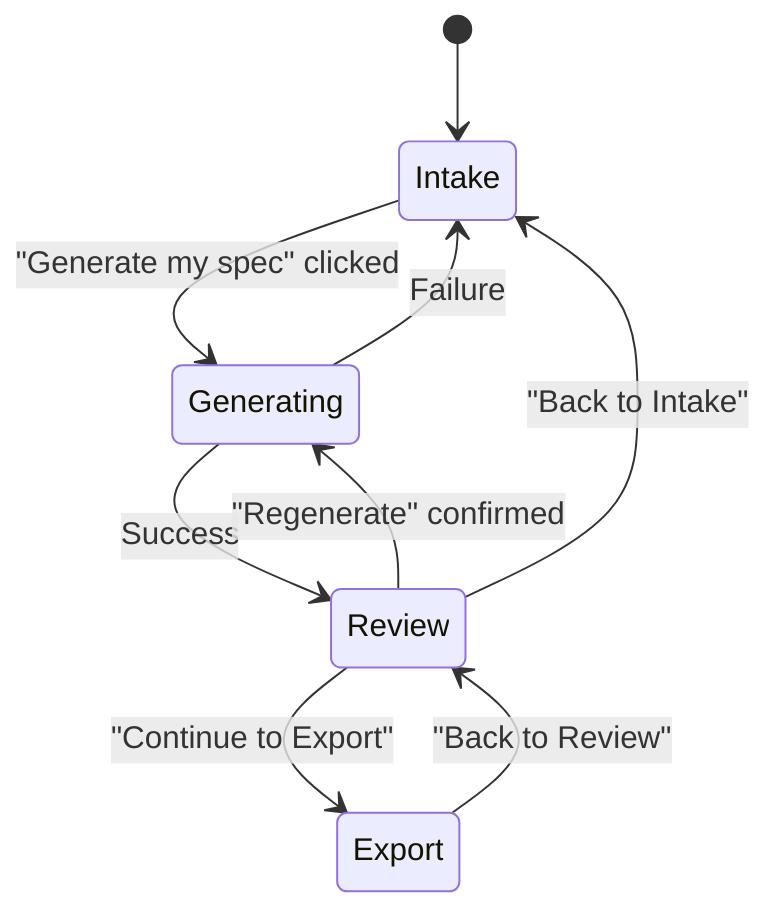

# Design Document: SpecFast — Spec Generator

## Overview

SpecFast is a single-page web application that guides users through a three-screen workflow: Intake → Review → Export. The core value proposition is speed — transforming a raw project idea into an AI-builder-ready spec in under 10 minutes.

The application is intentionally simple: no authentication, no persistence beyond the session, no multi-user collaboration. This simplicity drives the architecture toward a client-heavy SPA with a minimal backend for LLM-powered spec generation.

### Key Design Decisions

| Decision | Choice | Rationale |
|----------|--------|-----------|
| Framework | Next.js (App Router) | Fast setup, built-in API routes for the LLM call, great DX for solo devs, easy deployment to Vercel |
| Styling | Tailwind CSS | Rapid UI development, no design system overhead |
| State Management | React Context + useReducer | Three screens with shared state is simple enough; no need for Redux/Zustand |
| LLM Integration | Groq API (Llama 3.1 70B) via server-side API route | Free tier (30 RPM, 14,400 req/day), extremely fast inference, keeps API key secure |
| Deployment | Vercel | Zero-config for Next.js, generous free tier for indie projects |
| Testing | Vitest + fast-check | Fast, modern test runner with property-based testing support |

## Architecture

### High-Level Architecture



### Screen Flow



### Request/Response Flow for Spec Generation

1. User completes 7 questions on Intake Screen
2. Client sends POST to `/api/generate` with all 7 answers
3. API route constructs a structured prompt and calls Groq API
4. Groq returns structured JSON with labeled sections
5. API route validates response shape and returns to client
6. Client navigates to Review Screen with generated spec in state

## Components and Interfaces

### Screen Components

```
AppShell
├── IntakeScreen
│   ├── QuestionCard (displays current question + text input)
│   ├── ProgressIndicator (shows "{current} of 7")
│   ├── NavigationControls (Back button, conditional)
│   └── GenerateButton (shown after Q7 answered)
├── ReviewScreen
│   ├── SectionList
│   │   └── EditableSection[] (heading + editable body)
│   ├── RegenerateButton (with confirmation dialog)
│   └── NavigationControls (Back to Intake, Continue to Export)
└── ExportScreen
    ├── SpecPreview (read-only rendered spec)
    ├── CopyMarkdownButton
    ├── CopyCursorPromptButton
    └── NavigationControls (Back to Review)
```

### Key Interfaces

```typescript
// Application state
interface AppState {
  currentScreen: 'intake' | 'review' | 'export';
  intake: IntakeState;
  spec: SpecState;
}

interface IntakeState {
  currentQuestionIndex: number; // 0-6
  answers: string[];            // length 7, initially empty strings
}

interface SpecState {
  sections: SpecSection[];
  isGenerating: boolean;
  generationError: string | null;
  hasUnsavedEdits: boolean;
}

interface SpecSection {
  id: string;
  heading: string;
  body: string;
  isDirty: boolean;  // true if user has edited since last generation
}

// API contract
interface GenerateRequest {
  answers: string[]; // exactly 7 non-empty strings
}

interface GenerateResponse {
  sections: Array<{
    heading: string;
    body: string;
  }>;
}

// Action types for reducer
type AppAction =
  | { type: 'SUBMIT_ANSWER'; questionIndex: number; answer: string }
  | { type: 'GO_TO_QUESTION'; questionIndex: number }
  | { type: 'START_GENERATION' }
  | { type: 'GENERATION_SUCCESS'; sections: SpecSection[] }
  | { type: 'GENERATION_FAILURE'; error: string }
  | { type: 'EDIT_SECTION'; sectionId: string; body: string }
  | { type: 'SAVE_SECTION'; sectionId: string }
  | { type: 'NAVIGATE'; screen: 'intake' | 'review' | 'export' }
  | { type: 'CONFIRM_REGENERATE' };
```

### Export Formatters

```typescript
// Pure functions — no side effects, easily testable
function formatAsMarkdown(sections: SpecSection[]): string;
function formatAsCursorPrompt(sections: SpecSection[]): string;

// Clipboard interaction (thin wrapper)
async function copyToClipboard(text: string): Promise<boolean>;
```

### API Route: `/api/generate`

```typescript
// POST /api/generate
// Request: GenerateRequest
// Response: GenerateResponse | { error: string }
//
// Responsibilities:
// 1. Validate that exactly 7 non-empty answers are provided
// 2. Construct LLM prompt from answers
// 3. Call Groq API with structured output instructions
// 4. Validate response shape
// 5. Return sections to client
```

## Data Models

### Questions Configuration

The 7 intake questions are stored as a static configuration array:

```typescript
interface Question {
  id: number;        // 1-7
  text: string;      // The question displayed to the user
  placeholder: string; // Input placeholder hint
}

const QUESTIONS: Question[] = [
  { id: 1, text: "What's your project idea in one sentence?", placeholder: "e.g., A habit tracker for remote workers..." },
  { id: 2, text: "Who is this for? Describe your target user.", placeholder: "e.g., Freelance designers who..." },
  { id: 3, text: "What are the 3-5 core features?", placeholder: "e.g., 1. Dashboard 2. Notifications..." },
  { id: 4, text: "What tech stack or platform preference do you have?", placeholder: "e.g., React + Supabase, or 'no preference'..." },
  { id: 5, text: "Are there any design or UX constraints?", placeholder: "e.g., Mobile-first, dark mode, minimal..." },
  { id: 6, text: "What's the MVP scope — what can you cut?", placeholder: "e.g., No auth for v1, single user only..." },
  { id: 7, text: "Anything else the AI builder should know?", placeholder: "e.g., Must integrate with Stripe, use shadcn/ui..." },
];
```

### Spec Section Model

Generated specs contain 3+ sections. A typical generation produces:

```typescript
// Example generated spec structure
const exampleSpec: SpecSection[] = [
  { id: "overview", heading: "Project Overview", body: "...", isDirty: false },
  { id: "features", heading: "Core Features", body: "...", isDirty: false },
  { id: "tech-stack", heading: "Tech Stack & Architecture", body: "...", isDirty: false },
  { id: "data-model", heading: "Data Model", body: "...", isDirty: false },
  { id: "mvp-scope", heading: "MVP Scope & Constraints", body: "...", isDirty: false },
];
```

### State Persistence

- **Session only**: All state lives in React Context (useReducer). No localStorage, no database.
- **Rationale**: The tool is designed for quick, disposable sessions. Users export their spec and move on. Persistence adds complexity without matching the "under 10 minutes" use case.
- **Trade-off**: If the user refreshes, they lose progress. This is acceptable for v1 given the short session duration.

### Cursor Prompt Format Template

```typescript
const CURSOR_PROMPT_TEMPLATE = {
  preamble: `You are an expert software engineer. I have a project spec below that I'd like you to implement. Please review it carefully and build exactly what is described.\n\n---\n\n`,
  closing: `\n\n---\n\nPlease confirm you understand the spec above. Before writing any code, ask me clarifying questions about anything that is ambiguous or underspecified.`,
};
```

## Correctness Properties

*A property is a characteristic or behavior that should hold true across all valid executions of a system — essentially, a formal statement about what the system should do. Properties serve as the bridge between human-readable specifications and machine-verifiable correctness guarantees.*

### Property 1: Non-empty answer advances question

*For any* non-empty, non-whitespace-only string and any question index 0–5, submitting that answer via the app reducer should result in the currentQuestionIndex incrementing by exactly 1.

**Validates: Requirements 1.2**

### Property 2: Whitespace-only answers are rejected

*For any* string composed entirely of whitespace characters (including empty string), attempting to submit it as an answer should leave the currentQuestionIndex unchanged and the answer slot unmodified.

**Validates: Requirements 1.3**

### Property 3: Progress indicator formatting

*For any* question index in the range 0–6, the progress indicator text should equal `"${index + 1} of 7"`.

**Validates: Requirements 1.5**

### Property 4: Incomplete answer validation

*For any* array of 7 answer strings where at least one is empty or whitespace-only, the validation function should return exactly the indices of the empty/whitespace entries, and generation should be blocked.

**Validates: Requirements 2.6, 1.6**

### Property 5: Spec response validation requires 3+ sections

*For any* GenerateResponse object, the validation function should accept responses with 3 or more sections (each having non-empty heading and body) and reject responses with fewer than 3 sections.

**Validates: Requirements 2.2**

### Property 6: Generation failure preserves all intake answers

*For any* app state containing 7 filled answers and any error string, dispatching a GENERATION_FAILURE action should result in a state where all 7 answers are identical to the original and the currentScreen remains 'intake'.

**Validates: Requirements 2.5**

### Property 7: Section edit character limit

*For any* string with length greater than 5,000 characters, the edit operation should truncate or reject the input such that the stored section body never exceeds 5,000 characters. For any string with length ≤ 5,000, the full string should be stored.

**Validates: Requirements 3.2**

### Property 8: Save edit updates section body

*For any* valid section ID present in the spec state and any string of length ≤ 5,000, dispatching EDIT_SECTION followed by SAVE_SECTION should result in that section's body equaling the new string and isDirty being set to false.

**Validates: Requirements 3.3**

### Property 9: Regeneration success replaces all sections

*For any* previous spec state (with any number of edited sections) and any new valid sections array (3+ sections), dispatching GENERATION_SUCCESS with the new sections should completely replace all previous sections, and all new sections should have isDirty === false.

**Validates: Requirements 3.5**

### Property 10: Dirty sections require regeneration confirmation

*For any* spec state where at least one section has isDirty === true, the hasUnsavedEdits derived value should be true, indicating that a confirmation dialog is required before regeneration.

**Validates: Requirements 3.6**

### Property 11: Regeneration failure preserves existing sections

*For any* spec state with existing sections and any error string, dispatching GENERATION_FAILURE should leave the sections array completely unchanged (same length, same content, same isDirty flags).

**Validates: Requirements 3.7**

### Property 12: Markdown formatter includes all content

*For any* array of SpecSections (each with non-empty heading and body), the output of formatAsMarkdown should contain every section's heading formatted as a markdown header and every section's body text as-is.

**Validates: Requirements 4.3**

### Property 13: Cursor prompt format structure

*For any* array of SpecSections, formatAsCursorPrompt(sections) should equal the concatenation of PREAMBLE + formatAsMarkdown(sections) + CLOSING. The output must start with the preamble text and end with the closing instruction.

**Validates: Requirements 5.2, 5.3**

### Property 14: Navigation preserves application state

*For any* app state with filled intake answers and generated spec sections, dispatching any NAVIGATE action (to any screen) should preserve all intake answers unchanged and all spec sections unchanged.

**Validates: Requirements 6.3, 6.4, 1.8**

## Error Handling

### Client-Side Errors

| Error Scenario | Handling Strategy |
|----------------|-------------------|
| Empty/whitespace answer submission | Prevent advancement, show inline validation error below input |
| Generation API timeout (>30s) | Abort request, show "Generation took too long. Please try again." with Retry button |
| Generation API error (4xx/5xx) | Show error message with failure reason, preserve answers, show Retry button |
| Invalid API response shape | Treat as generation failure, show generic error |
| Clipboard API unavailable | Show fallback message: "Copy failed. Please select and copy the text manually." |
| Clipboard write failure | Show error toast, keep spec content visible on screen |
| Section edit exceeds 5000 chars | Truncate input at 5000 characters, show character count indicator |

### Server-Side Errors (API Route)

| Error Scenario | Handling Strategy |
|----------------|-------------------|
| Missing/invalid answers in request body | Return 400 with `{ error: "Exactly 7 non-empty answers required" }` |
| Groq API key not configured | Return 500 with `{ error: "Service configuration error" }` |
| Groq API rate limit | Return 429 with `{ error: "Too many requests. Please wait a moment and try again." }` |
| Groq API timeout | Return 504 with `{ error: "Generation timed out. Please try again." }` |
| Malformed LLM response | Retry once with same prompt; if still malformed, return 500 with `{ error: "Failed to generate spec. Please try again." }` |

### Error UX Principles

- Errors are non-destructive: user data (answers, edits) is never lost due to an error
- Errors are actionable: every error message includes a clear next step (retry, try again, copy manually)
- Errors are dismissible: error messages can be cleared by the user or auto-dismiss after action

## Testing Strategy

### Property-Based Tests (Vitest + fast-check)

Property-based testing is appropriate for this feature because the core logic consists of pure functions (reducer, formatters, validators) with clear input/output behavior and universal properties that hold across a wide input space.

**Library**: `fast-check` with Vitest
**Configuration**: Minimum 100 iterations per property test
**Tag format**: `Feature: spec-generator, Property {number}: {property_text}`

Target functions for PBT:
- `appReducer` — state transitions (Properties 1, 2, 6, 8, 9, 11, 14)
- `validateAnswers` — input validation (Properties 2, 4)
- `validateGenerateResponse` — response validation (Property 5)
- `formatProgressIndicator` — formatting (Property 3)
- `formatAsMarkdown` — export formatting (Property 12)
- `formatAsCursorPrompt` — export formatting (Property 13)
- `enforceSectionCharLimit` — edit validation (Property 7)
- `hasUnsavedEdits` — derived state (Property 10)

### Unit Tests (Vitest)

Example-based tests for specific scenarios:
- Initial app state renders first question (1.1)
- Only one question visible at a time (1.7)
- Generate button appears after all 7 questions answered (1.6)
- Loading indicator shown during generation (2.4)
- Navigation to Review after successful generation (2.3, 6.1)
- Regenerate button present on Review screen (3.4)
- Copy buttons present on Export screen (4.1, 5.1)
- Copy button disabled when no spec exists (4.2)
- Confirmation toast duration (4.4, 5.4)
- Clipboard failure shows error (4.5, 5.5)
- Empty spec shows error on Cursor copy (5.6)

### Integration Tests

- Full generation flow: submit 7 answers → call API → receive structured spec → navigate to Review (mocked Groq)
- Regeneration flow: edit sections → regenerate → verify new sections replace old
- Export flow: generate spec → navigate to Export → copy as Markdown → verify clipboard content

### Performance Tests

- Screen transitions complete within 2 seconds (7.4)
- Clipboard copy completes within 1 second (7.5)
- Generation completes within 30 seconds with real API (7.2, manual/CI)


